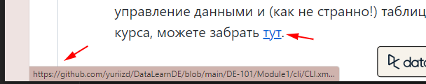

> [Начало](../../README.md) >> Модуль 1

# DataLearn Module 1

#module1 #excel #dashboard #markdown #obsidian #git 

# Домашнее задание

**Модуль 1** преследует такие цели:
- Git. Установка и практика.
- Markdown. Оформление.
- Инструменты для построения диаграмм и схем.
- Excel. Построение дашборда.

# Git

Мои рекомендации для тех, кто не имел дела с данными совсем:
- Если не работали совсем с командной строкой, начните выполнять задание с Excel. Сначала нужно понять что Вы вообще можете делать с данными.
- [Introduction into Shell](https://www.datacamp.com/courses/introduction-to-shell-for-data-science) от DataCamp классный курс. Там собраны основные команды, которых хватает на уверенное управление данными и (как не странно!) таблицами через консоль. Но он платный :(. Сделал интелект карту с этого курса, можете забрать [тут](cli/CLI.xmind). Позже я еще сюда добавлю команды bash скриптам, по git и команды по процессингу данных от DataCamp. 

- Для Windows 10: обязательно обновите Powershell, установите Terminal (сам Microsoft его рекомендует), установите WSL. Terminal - это очень удобно, все в одном. Оформлений море на выбор. 

- Установите Git Bash.
- Старайтесь все обновления в свой репозиторий делать через консоль первое время.
- Превосходные материалы по git есть у [ADV-IT](https://www.youtube.com/watch?v=DK2PsTcSFFM&list=PLg5SS_4L6LYstwxTEOU05E0URTHnbtA0l). Автор показывает как им пользоваться на конкретных реальных задачах, ничего лишнего.

# Markdown

Мне не нравиться редактировать файлы в самом браузере в github. Это не особо удобно, особенно если нет постоянного доступа в internet.
Поиски дали результат. Есть программа Obsidian, в которой можно все редактировать. **Obsidian - это реально круто.** 

В разметке маркдаун большие возможности, Obsidian расширяет эти возможности форматирования. Не хотите, не используйте лишнее.

Пока весь проект веду исключительно в этой программе. Нужна практика, т.к. мне не очень нравится, как писал выше, форматировать онлайн (на момент написания 60% времени нет света) + вставлять ссылки на картинки и файлы в описание, используя внешние ссылки с github. 
Скриншоты частей экрана автоматом попадают в нужную директорию, когда вставляешь их прямо в текст. 

При просмотре через браузер на странице github'a ссылки становятся правильными, т.к. они у меня выставленны быть относительными. 

# Инструменты для построения диаграмм и схем

Я работаю в большой ISP, однако с доставкой данных там не очень. Поэтому сделал простую схему для небольшого интернет магазина. 

Предполагается, что есть отчетности, выгружаемые в FineBI, и прайсы для партнеров в Excel.

# Excel

Прежде чем строил башборд, прошел почти все курсы по Excel от DataCamp. По окончанию стало легче работать с таблицами и гуглтаблицами, не так страшно что-то испортить)). Появилось понимание по работе с данными, как фильтровать, что делать с отстутствующими данными, как проводить базовую проверку данных на пригодность.

Мои рекомендации:
- Используйте несколько источников для обучения, то что в одном обьяснили так себе, в другом может зайти намного легче.
- Используйте формулы на английском. Да, сразу привыкайте к английским формулам.
- Вы можете через Google Translate переводить формулы в любую сторону. Это прикольно.
- Excel и SpreadSheets хороши. В последнем отчетность может быть доступна всем в несколько нажатий.
- SORT() доступна в только в платной версии Excel, в Google есть все из коробки без необходимости чтото покупать.

Интелект карта по командам Excel. Смотреть через Xmind, т.к. есть еще комментарии и примеры формул. [Excel-n-Sheets.xmind](Excel/Excel-n-Sheets.xmind)

# Dashboard. Superstore

 

Увеличил для наглядности.

Срезы работают. Осторожно! PivotCash! xDDDD

По поводу срезов и больших дашбордов. Рекомендации из сети:
- Давайте вашим данным (cell range, таблицам) имена. Тогда новые добавленные данные будут автоматом подключатся.
- Нужно больше сводных таблица чем одна? Сделайте одну, скопируйте лист, измените сводную таблицу.

PivotCash - это головна боль, потому что ваше срезы (slicers) просто не будут подключаться к разным сводным таблицам, даже если у них одинаковый источник. Мне пришлось переделывать пол работы.

# Bonus

Небольшая интелект карта по Аналитике данных как таковой. Дополняется по мере поступления информации.
Вообще всем рекомендую использовать интелект карты для обучения и систематизации своих знаний. Практика показывает, что **10 листов книги можно вместить в одну страницу**. Конспектирование Вам не дает общую картину. Мгновенный доступ без необходимости поиска.

[DataAnalysis.xmind](DataAnalysis.xmind)

Для открытия файлов использовать программу Xmind. Бесплатных возможностей хватит на 98% ваших хотелок.

---
> [Начало](../../README.md) >> Модуль 1