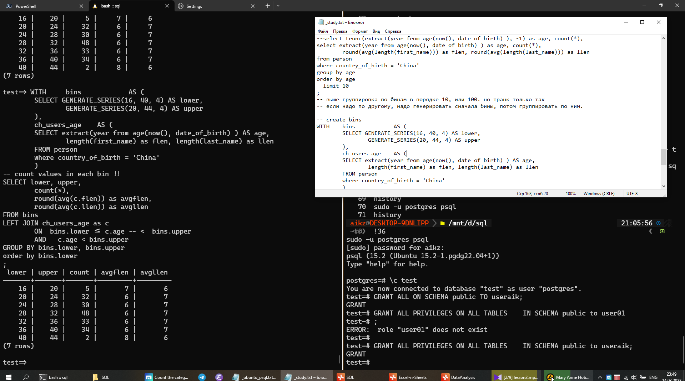
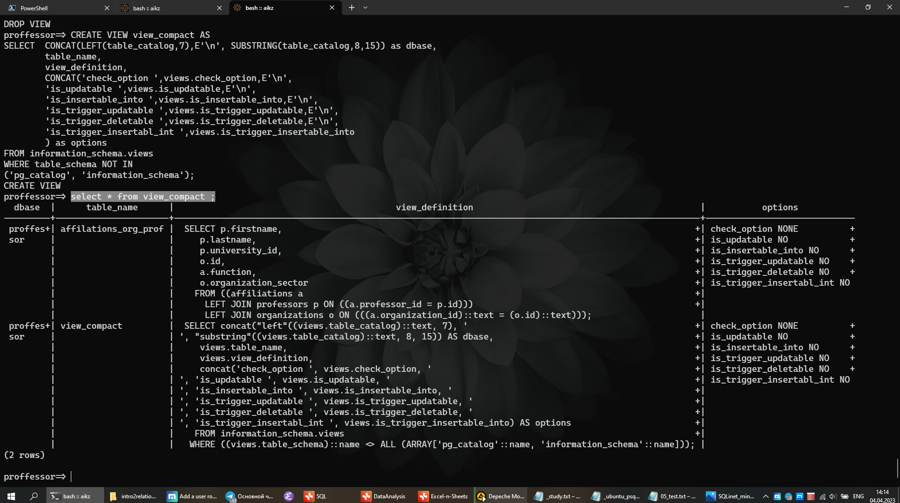

> [Начало](../../README.md) >> Модуль 2

# DataLearn Module 2

#module2 #sql #postgres #csv #psql #shell


# Домашнее задание

**Модуль 2** преследует такие цели:

- База данных. 
	- Установка, подключение. 
	- Cоздание БД, запросы.
- Модели данных.
- База данных в облаке.
- Сервисы визуализации для баз данных.

---

# База данных

## Установка. Подключение

Тут, конечно, есть что описать. Ставил Postgres 15 на Win10, немного поупражнялся. Потом перешел на WSL полностью. Обо всем по порядку.

### Postgres + Win

Далее, далее, все готово :). Встроеный pgAdmin работает. DBeaver подключил, сложностей нет. Сразу перешел на psql клиент. Не знаю почему, но по моему мнению - изучать стоит sql прямо из консоли. Во первых, там есть все. Во вторых, нет перегрузки интерфейса. Залет в любую IDE похож на случайное попадание школьника в кабину пилота самолета, становится страшно от этой кучи кнопок xDD. А так ничего лишнего, только то что выучил. На скринах WSL, это для примера.



Вьюха для Вьюхи.




Мне сильно помог вот этот парнишка [freeCodeCamp.org
Learn PostgreSQL Tutorial - Full Course for Beginners](https://www.youtube.com/watch?v=qw--VYLpxG4), он хорошо показал как пользоваться именно консолью, а не IDE. Ну а потом Вы уже сможете под свои потребности подобрать текстовый редактор для SQL или IDE.

На счет самого psql в windows, у него есть косяк с кодировкой. Косячит, даже если у тебя база данных создана в UTF8 и кодировка, везде где можно, выставленна UTF8, ты все равно будешь получать ошибку при выводе, например, `'México D.F.'`.

	ОШИБКА:  для символа с последовательностью байт 0xc3 0xb3 из кодировки "UTF8" нет эквивалента в "WIN1251"

Как исправить?

	-- вот так можно проверить настройки
	SHOW server_encoding;
	SHOW client_encoding;
	
	-- следующее вводить находясь в консоле psql/windows
	SET client_encoding TO 'UTF8'; 
	psql \! chcp 1251

Работает, отлично! Но надо вписывать каждый раз, настройки не сохраняет.

### Postgres + WSL

Установка в пару действий по мануалу с оф сайта postgres. Но нельзя просто так выполнить авторизацию в pqsl в линуксе по логину и паролю xDDD. По умолчанию авторизация по ключам линукса через sudo (запуск с правами суперпользователя). Но делать авторизацию от суперпользователя вообще не лучшая практика, к тому же клиенты типа HeidiSQL, или того-же Бобра, предлагают Вам авторизацию по логину и паролю. И что-бы их из windows подружить вместе с WSL надо немного потанцевать. Бубна не было, пользовался только поиском).

Задача стояла такая: с внешки иметь возможность подключиться к postgres/wsl по моему придуманному логину и паролю.

1. Стартуем сервер

		sudo service postgresql start 

2. Разрешаем самой базе данных принимать авторизацию по логину и паролю, по умолчанию она отключена. Надо найти эти строки и исправить на md5, md5 - это авторизация по паролю.

		sudo nano /etc/postgresql/15/main//pg_hba.conf
		
		# "local" is for Unix domain socket connections only
		local   all          all                         md5
		# IPv4 local connections:
		host    all          all        0.0.0.0/0        md5

3. Запускаем psql, как от суперпользователя root в самом linux через пользователя postgres (который создался на этапе установке базы данных), карочи бред. Для того, чтобы не было мешанины с названиями типа postgres-postgres, создаю в самой базе данных пользователя useraik.

		sudo -u postgres psql 
		
		CREATE USER useraik PASSWORD 'aik123' CREATEDB;

4. Проверяем как работает, уже без sudo.

		psql -U useraik -h 127.0.0.1 -d postgres


В таком варианте мы можем работать от пользователя useraik, создавать свои новые базы данных, генерировать и прочее. Но уже загрузить свои данные из ОС не можем, потому что у нас нет прав. В принципе, это нормально. Всегда можно зайти с помощью sudo (администратора), сделать импорт/экспорт и дальше работать через `useraik` без страха дропнуть соседнюю чужую базу. Если Вы еще ни разу не дропали не ту таблицу, я Вам завидую)).

### Postgres + CSV/SQL

Импорт и экпорт CSV/SQL файлов - это вообще нативная штука. Это как открыть документ Word или сохранить его с другим именем. Тебе всегда надо что-то брать с книжной полки и ставить что-то другое на неё. 


#### Import

Берем [summer.csv](SQL/Source/summer.csv) для примера. Кладем в `D:\summer.csv`. Создаем таблицу в своей базе данных, импортируем. Пути указаны для WSL.

```sql
CREATE TABLE summer (
year integer,
city varchar(30),
sport varchar(30),
discipline varchar(30),
athlete varchar(50),
country varchar(10),
gender varchar(10),
event varchar(50),
medal varchar(10)
);

COPY summer(year,city,sport,discipline,athlete,country,gender,event,medal)
FROM '/mnt/d/summer.csv'
DELIMITER ','
CSV HEADER;
```

Тоже что и выше с помощью SQL файла.  Сохраняете код выше в файл, например, `D:\summer_import.sql` и в psql выполните команду `\i /path/to/file`.

```shell
\i /mnt/d/summer_import.sql
```

Результат будет идентичный.

Вариант импорта снимка таблицы из обочки Linux.

```shell
psql --dbname=mydb --username=postgres -f /tmp/mydb.sql
```

#### Export

Выгружаем целую таблицу или выборку из таблицы в CSV.

```sql
COPY table_contacts TO '/mnt/d/contacts.csv'  
WITH DELIMITER ',' CSV HEADER;

COPY (SELECT * FROM contacts WHERE age < 45) TO '/mnt/d/young_contacts.csv'  
WITH DELIMITER ',' CSV HEADER;
```

Или выгружаем только данные из таблицы в виде SQL кода.

```shell
pg_dump -U postrges --column-inserts --data-only --table=person test > table_from_dump.sql
```

Пример выгруженных строк.

```sql
INSERT INTO public.person (id, first_name, last_name, gender, email, date_of_birth, country_of_birth) VALUES (986, 'Hali', 'Juschka', 'Female', NULL, '1990-08-21', 'Colombia');
```


## Создание базы данных. Запросы

### Задание 1

> *Вам необходимо установить клиент SQL для подключения базы данных. Вы можете посмотреть [инструкции по установки DBeaver](https://github.com/Data-Learn/data-engineering/blob/master/how-to/%20How%20to%20install%20DBeaver.md). Так же вы можете использовать любой другой клиент для подключения к ваше БД.*

#### DBeaver

Добавить новое соединение, заполнить поля. IP хоста смотреть командой `ifconfig` для ubuntu.


#### HeidiSQL

Все тоже самое.


### Задание 2

> *Создайте 3 таблицы и загрузите данные из [Superstore Excel файл](https://github.com/Data-Learn/data-engineering/blob/master/DE-101%20Modules/Module01/DE%20-%20101%20Lab%201.1/Sample%20-%20Superstore.xls) в вашу базу данных. Сохраните в вашем GitHub скрипт загрузки данных и создания таблиц. Вы можете использовать готовый [пример sql файлов](https://github.com/Data-Learn/data-engineering/tree/master/DE-101%20Modules/Module02/DE%20-%20101%20Lab%202.1).*

1. Сделал CSV для каждой таблицы: [orders.csv](SQL/Source/orders.csv), [people.csv](SQL/Source/people.csv), [returns.csv](SQL/Source/returns.csv).

2. Захожу от обычного пользователя, создаю новую базу, подключаюсь к базе `superstore` (автоматом нас кидает в базу postgres).

```shell
❯  psql -U useraik -h 127.0.0.1 -d postgres

Password for user useraik:
psql (15.2 (Ubuntu 15.2-1.pgdg22.04+1))
SSL connection (protocol: TLSv1.3, cipher: TLS_AES_256_GCM_SHA384, compression: off)
Type "help" for help.

postgres=> CREATE DATABASE superstore;
CREATE DATABASE

postgres=> \c superstore
superstore=>
```

3. Создаю таблицы с помощью написанного ранее запроса [orders_create_table.sql](SQL/Source/orders_create_tables.sql) (пути для импорта указаны явно), проверяю созданы ли таблицы, выхожу.

```shell
superstore=> \i /mnt/d/git/DataLearnDE/DE-101/Module2/SQL/Source/orders_import.sql

psql:/mnt/d/git/DataLearnDE/DE-101/Module2/SQL/Source/orders_create_tables.sql:8: NOTICE:  table "orders" does not exist, skipping
DROP TABLE
CREATE TABLE
psql:/mnt/d/git/DataLearnDE/DE-101/Module2/SQL/Source/orders_create_tables.sql:36: NOTICE:  table "people" does not exist, skipping
DROP TABLE
CREATE TABLE
psql:/mnt/d/git/DataLearnDE/DE-101/Module2/SQL/Source/orders_create_tables.sql:45: NOTICE:  table "returns" does not exist, skipping
DROP TABLE
CREATE TABLE

superstore=> \d

              List of relations
 Schema |     Name      |   Type   |  Owner
--------+---------------+----------+---------
 public | orders        | table    | useraik
 public | orders_id_seq | sequence | useraik
 public | people        | table    | useraik
 public | returns       | table    | useraik
(4 rows)

superstore=> \q
```

Это для того, что-бы этот пользователь был владельцем базы и таблиц, тогда не надо перекидывать права на чтение/правку/удаление таблиц.

4. Захожу через администратора, подключаюсь к базе `superstore` (автоматом нас кидает в базу postgres). 

```shell
❯  sudo -u postgres psql     
could not change directory to "/home/aikz": Permission denied
psql (15.2 (Ubuntu 15.2-1.pgdg22.04+1))
Type "help" for help.

postgres=# \c superstore
superstore=#
```

5. Делаю импорт с помощью написанного ранее запроса  [orders_import.sql](SQL/Source/orders_import.sql) (пути для импорта указаны явно). Обратите внимание, что внутри указан разделитель как точка-с-запятой `DELIMITER ';'`, потому что Excel выгружает так.

```shell
superstore=# \i /mnt/d/git/DataLearnDE/DE-101/Module2/SQL/Source/orders_import.sql

COPY 9994
COPY 4
COPY 800
```

Теперь можно подключаться, как обычный пользователь, и уже делать необходимые запросы.

### Задание 3

> *Напишите запросы, чтобы ответить на вопросы из [Модуля 01](https://github.com/Data-Learn/data-engineering/tree/master/DE-101%20Modules/Module01/DE%20-%20101%20Lab%201.1#%D0%B0%D0%BD%D0%B0%D0%BB%D0%B8%D1%82%D0%B8%D0%BA%D0%B0-%D0%B2-excel). Сохраните в вашем GitHub скрипт загрузки данных и создания таблиц.*

По заданию сделал запросы, что-бы получить таблицы, по которым делал дашборд в Excel в первом модуле.

- Вспомогательные действия - [sql](SQL/dashboard/00add.sql)
- ComboChart - [sql](SQL/dashboard/01combochart.sql)
- WaterfallChart - [sql](SQL/dashboard/02waterfall.sql)
- PieChart - [sql](SQL/dashboard/03piechart.sql)
- MapChart - [sql](SQL/dashboard/04mapchart.sql)
- Top5 Subcategory - [sql](SQL/dashboard/05top5.sql)
- KPI - [sql](SQL/dashboard/06kpi.sql)
- KPIYOY - [sql](SQL/dashboard/07kpiyoy.sql)

Вам удобнее их будет посмотреть на [отдельной странице](SQL/superstor_sql_querry.md) с описанием и результами вывода.

---

# Модели данных

### Задание 1

> *Вам необходимо нарисовать модель данных для нашего файлика [Superstore](https://github.com/Data-Learn/data-engineering/blob/master/DE-101%20Modules/Module01/DE%20-%20101%20Lab%201.1/Sample%20-%20Superstore.xls):*
> 
> -   *Концептуальную*
> -   *Логическую*
> -   *Физическую*  
> 
> *Вы можете использовать бесплатную версию [SqlDBM](https://sqldbm.com/Home/) или любой другой софт для создания моделей данных баз данных.*

### Задание 2

> *Когда вы нарисуете модель данных, вам нужно скопировать DDL и выполнить его в SQL клиенте.*

### Задание 3

> *Вам необходимо сделать `INSERT INTO SQL`, чтобы заполнить **Dimensions** таблицы и **Sales Fact** таблицу. Сначала мы заполняем **Dimensions** таблицы, где в качестве **id** мы генерим последовательность чисел, а зачем **Sales Fact** таблицу, в которую вставляем **id** из **Dimensions** таблиц. Такой пример я рассматривал в видео.*

## Результат

Выношу [последовательный разбор всех заданий](dbmodel/superstore_dbmodel.md) на отдельную страницу, т.к. все преобразования занимают очень много места. Поскольку задания делаю для себя, то описывать буду в полном объеме максимально простым языком.

Готовые запросы ниже.

- Создание новых таблиц - [sql](dbmodel/00_new_dbmodel.sql)
- Заполнение данными, часть 1 - [sql](dbmodel/01_datamigration.sql)
- Заполнение данными, часть 2 - [sql](dbmodel/02_datamigration.sql)

---

# База данных в облаке

## AWS Lightsail 

С **Lightsail** начать было проще всего. Но это было интересное приключение. Я тестил сначала через IDE, и понял что я не могу переключаться между базами данных в клиенте. Поэтому пошел в `psql` - cоединение вышло изи совсем.

```bash
psql -U dbmasteruser -h ls-1efb3f.cbcuz.eu-central-1.rds.amazonaws.com -d postgres 
```

Смотрим что у нас есть: какие схемы, какие таблицы.

```sql
SELECT catalog_name, schema_name, schema_owner
FROM information_schema.schemata;
```

```sql
 catalog_name |    schema_name     | schema_owner
--------------+--------------------+--------------
 postgres     | pg_catalog         | rdsadmin
 postgres     | information_schema | rdsadmin
 postgres     | public             | dbmasteruser
(3 rows)
```

```sql
SELECT table_schema, table_name
FROM information_schema.tables
WHERE table_schema NOT IN ('information_schema', 'pg_catalog')
ORDER by table_schema, table_name
;
```

```sql
 table_schema | table_name
--------------+------------
(0 rows)
```

Схем нет, таблиц нет. Надо срочно исправлять xD.

### `stg` schema

Создают схему stg используя код [cloud/01_stg.sql](cloud/01_stg.sql).

Что изменил по сравнению с прошлыми заданиями:

- `DROP SCHEMA IF EXISTS stg CASCADE;` как бальзам на душу, помогает
- добавляю сразу две колонки с типом `DATA`

### `stg` import

В прошлом задании не было схем, поэтому было как-то проще. Импорт CSV через `COPY` по удаленке у меня выдало ошибку. Пришлось искать вариант выгрузки своей готовой базы в SQL. Через нормальный дамп мне не подошло, потому что там куча кода по созданию вообще всех таблиц и данных. Нашел вариант выгрузки чисто одной таблицы в SQL.

```bash
pg_dump -h localhost -U postgres --column-inserts --data-only --table=orders_old superstore > ~/superstore_orders_old.sql
```

Получился SQL чисто для одной таблицы. В самом начале и в самом конце закомментировал какие-то настройки. Но оказалось, что вставка строк начинается с `INSERT INTO public.orders_old `.

```sql
INSERT INTO public.orders_old (id, order_id, order_date, ship_date, ship_mode, customer_id, customer_name, segment, country, city, state, postal_code, region, product_id, category, subcategory, product_name, sales, quantity, discount, profit, order_date2, ship_date2) VALUES (30, 'US-2017-150630', '17.09.2017', '21.09.2017', 'Standard Class', 'TB-21520', 'Tracy Blumstein', 'Consumer', 'United States', 'Philadelphia', 'Pennsylvania', '19140', 'East', 'FUR-FU-10004858', 'Furniture', 'Furnishings', 'Howard Miller 13-3/4" Diameter Brushed Chrome Round Wall Clock', 124.2, 3, 0.2, 15.525, '2017-09-17', '2017-09-21');
```

Что очень не подходит, потому что мне импорт нужно делать в схему `stg`. Помог `sed` - сделал замену в части текста в строке на другой.

```bash
sed 's/public.orders_old/stg.orders/g' superstore_orders_old.sql > stg-orders_import.sql
```

Далее просто выполнил запуск файла с компьютера. Выполнялось по 1 команде, достаточно долго. Не как восстановление дампа.

```sql
postgres=> \i ~/02_stg-orders_import.sql
```

Но работает.

```sql
postgres=> SELECT COUNT(*) FROM stg.orders ;
 count
-------
  9994
(1 row)
```

Полная загрузка - [cloud/02_stg-orders_import.sql](cloud/02_stg-orders_import.sql).

### `stg.orders` чистка данных

Так как с данными были небольшие косяки, все исправления собрал уже в одном вместе - [cloud/03_fix_data.sql](cloud/03_fix_data.sql).

### `dw` schema

Создание схемы и таблиц - [cloud/04_dw.sql](cloud/04_dw.sql).

### Перенос данных

Собрал в один файл - [cloud/05_migration.sql](cloud/05_migration.sql).

Столкнулся с тем, что надо явно указывать колонки в `INSERT`. Все потому что, когда эту таблицу сначала создавал,  `delivery_place_id` поставил как первую колонку, она у меня `SERIAL`.

```sql
INSERT INTO dw.delivery_places
	(country, city, state, postal_code, region)
SELECT DISTINCT country, city, state, postal_code, region
FROM stg.orders
;
```

Вобщем тогда ловишь ошибку.

```sql
postgres=> INSERT INTO dw.delivery_places
SELECT DISTINCT country, city, state, postal_code, region
FROM stg.orders
;
ERROR:  column "delivery_place_id" is of type integer but expression is of type character varying
LINE 2: SELECT DISTINCT country, city, state, postal_code, region
                        ^
HINT:  You will need to rewrite or cast the expression.
```

А если колонку с `SERIAL` создать в конце и сделать импорт похожим образом, то все получается сразу.

```sql
CREATE TABLE dw.ship_modes
(
  ship_mode VARCHAR(14) NOT NULL,
  ship_mode_id SERIAL NOT NULL,
  PRIMARY KEY (ship_mode_id)
);

INSERT INTO dw.ship_modes
SELECT DISTINCT ship_mode
FROM stg.orders
;
```

Все получилось.

## AWS RDS

Создал инстанс по инструкции. Ничего сложно, главное обращайте внимание на каком сервере Вы создаете свои сервера, потому что легко потерятся...

Повторять все что выше для Lightsale не стал. Поэтому захотел просто перенести дампом базу в новое место.

```bash
pg_dump -h ls-1e3f.cbuz.eu-central-1.rds.amazonaws.com -Fc -U dbmasteruser postgres > /home/aikz/superstore_aws_ls.dump
```

Из базы `postgres` (Lightsail) буду кочевать в `superstore` (RDS). B RDS у меня нет пользователя `dbmasteruser`, поэтому использую `--no-onwer`.

```bash
pg_restore -U postgres -h database-1-for-de123.ckebt.eu-central-1.rds.amazonaws.com -d superstore --no-owner /home/aikz/superstore_aws_ls.dump
```

Пробовал использовать выгрузку в скрипт (точно как с локальной машины, только не одну таблицу, а всю базу) - сам SQL код сохраняет нормально, но при восстановлении пишет ошибку что нет пользователя `dbmasteruser`. Да, я могу его создать. А потом переносить права на нужного мне? А если там задействован не один пользователь? Получается, возможности восстановления из чисто SQL малость ограничены. Дамп и его восстановление через `pg_restore` дает больше возможностей - импорт отдельно схем, отдельно таблиц, отдельно данных.

```bash
pg_dump -h ls-1ef22a3f.cbveuz.eu-central-1.rds.amazonaws.com -U dbmasteruser postgres > /home/aikz/superstore_aws_ls.sql
```

```bash
psql -U postgres -h database-1-for-de123.ckebt.eu-central-1.rds.amazonaws.com -d new_database -f /home/aikz/superstore_aws_ls.sql
...
psql:/home/aikz/superstore_aws_ls.sql:26: ERROR:  role "dbmasteruser" does not exist
...
```

Но если пользователя `dbmasteruser` создать в своей новой базе, то будет все работать. 

---

# Сервисы визуализации для баз данных

## Looker Google

Делал только для него. Он очень простой, бесплатный и много коннекторов. Если надо что-то сделать быстро в интеграции с Excel, то это неплохой вариант на скорую руку, тем более для небольшого количества данных. Можно делать выгрузку в PDF, отправлять отчеты по расписанию.

Сделал парочку диаграмм, что делал в первом модуле. Добавил срезы.


~~Хотел добавить KPI Profit Margin, но не нашел как. Он рассчитывался по формуле `SUM(profit)/SUM(sales)*100` и получались проценты. Здесь я могу добавить новую колонку как `profit/sales*100` и только после происходит суммирование, но мне это дает совсем другой результат. Добавить второй источник данных я могу, но тогда срезы с другого работать не будут.~~

Update: Спасибо [Ольге](https://github.com/Bigdataworm/Datalearn/blob/main/DE-101/Module2/readme.md)! Добавил новую колонку вот по такой формуле и теперь считается правильно.


# Bonus

Если Вы хотите свободнее ориентироваться в командной строке, git и удобно работать с github - я записал видео для обучения. Порог вхождения **нулевой**. Надеюсь, Вы сразу захотите пользоваться WSL в работе. 48 минут.

> [TopRanker - Подготовка рабочего окружения Командная строка Git GitHub Obsidian](https://www.youtube.com/watch?v=WkT2gBPRhiA)

Продолжение темы командной строки. Здесь человек просто обучает базам данных Postgres, но исключительно из командной строки. По желанию. Импорт данных из консоли, это легко :).

> [freeCodeCamp.org - Learn PostgreSQL Tutorial - Full Course for Beginners](https://www.youtube.com/watch?v=qw--VYLpxG4)

!!! Как планировать и разрабатывать базу данных. ***Сущности наше все.*** Рекомендую всем начинающим и даже тем, кто выполнил задание по второму модулю SQL. 8 часов.

> [freeCodeCamp.org - Database Design Course - Learn how to design and plan a database for beginners](https://www.youtube.com/watch?v=ztHopE5Wnpc)

Пописав SQL код в Блокноте, я решил поискать модный текстовый редактор для SQL под свои запросы. Раньше использовали Atom, но он уже не поддерживается. Нашел вот что. Посмотрите начало (минут 20-25) как пользуются Rider IDE. Сомневаюсь, что Вы захотите больше пользоваться Бобром :).

> [[JetBrains - Working With SQL and Databases in Rider](https://www.youtube.com/watch?v=iNWWWj8dCfM)

Для тренировки импорта базы и дополнительных заданий для SQL, можете использовать учебную базу Northwind. База по продажам, будет с чем сравнить. 

> [github ChickenLeg05/Northwind-Database](https://github.com/ChickenLeg05/Northwind-Database)

Сделал интеллект карту для SQL. Но надо поработать над структурой в левой части - пока не знаю как лучше сделать. А так она вполне рабочая, в комментариях примеры с кодом и все доступно на одной странице - не надо лазить по закладкам. [SQL.xmind](SQL.xmind)


---

> [Начало](../../README.md) >> Модуль 2